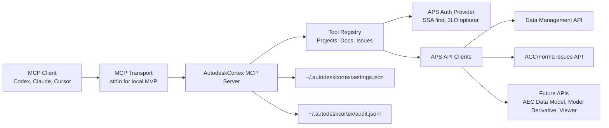

# AutodeskCortex ACC/Forma MCP Design

## Objective

Build a standalone MCP server for Autodesk Platform Services that lets AI clients inspect Autodesk Construction Cloud and Autodesk Forma project data in a controlled, auditable way.

The first release is ACC-first and read-only: accounts, projects, folders, files, versions, issues, and issue metadata. The design deliberately leaves a clean path for Autodesk Forma Build modules, APS Viewer, Model Properties, and AEC Data Model queries in later phases.

## Context Confirmed On 2026-06-05

No existing LuDattilo GitHub repository or RevitCortex remote branch appears to contain an ACC/Forma/APS MCP server. Checks covered:

- `gh repo list LuDattilo --limit 100`
- `gh search code` for `Autodesk Construction Cloud`, `developer.api.autodesk.com`, `autodeskforma`, and `Autodesk Forge`
- `git ls-remote --heads origin` filtered for `acc`, `forma`, `aps`, `forge`, `autodesk`, `mcp`
- local `rg` scans in `RevitCortex`

Official Autodesk references now exist and should shape the implementation:

- Autodesk describes MCP servers as lightweight mediators between MCP clients and Autodesk data/tools, responsible for identity, permissions, validation, and predictable execution boundaries: https://help.autodesk.com/view/ADSKMCP/ENU/?guid=ADSKMCP_CommonContent_about_autodesk_mcp_servers_html
- Autodesk APS guidance for custom MCP servers documents the two auth layers, APS auth options, tool schemas, and `content` plus `structuredContent` result patterns: https://aps.autodesk.com/blog/building-custom-mcp-servers-autodesk-platform-services
- Data Management API accesses Forma Data Management, BIM 360 Docs, and Fusion Team projects through hubs, projects, folders, items, and versions: https://aps.autodesk.com/data-management-api
- Secure Service Accounts are GA and are designed for automation against APIs that otherwise require 3-legged user context: https://aps.autodesk.com/blog/update-secure-service-accounts-ssa-goes-ga
- AEC Data Model API is production-capable for published Revit 2024+ models and initially exposes read-only GraphQL access to elements, parameters, property values, versions, and searches: https://aps.autodesk.com/blog/general-availability-aec-data-model-api-here

Useful official sample repositories:

- `autodesk-platform-services/aps-mcp-server-nodejs`: Node.js stdio MCP server with SSA auth and tools for projects, folders, issues, and issue types.
- `autodesk-platform-services/aps-mcp-app-example`: Streamable HTTP MCP App sample with APS Viewer, project/design browsing, hierarchy, properties, and preview.
- `autodesk-platform-services/aps-aecdm-mcp-dotnet`: .NET MCP server for AEC Data Model with PKCE auth and viewer-oriented tools.

## Recommended Product Shape

Create a new standalone repo named `AutodeskCortex`.

Do not fold this into RevitCortex. RevitCortex is a live Revit plugin plus local MCP bridge. ACC/Forma is cloud-first, can run without Revit, has different authentication, and should be deployable as a local or hosted MCP service.

The server should still feel like the Cortex family:

- Small, domain-specific tools rather than raw REST wrappers.
- Structured JSON results with concise human text.
- Explicit read/write classification.
- Settings file with disabled tool groups and auth mode.
- Audit log that never records tokens or full sensitive payloads.
- Safe write operations gated by dry-run, confirmation, or an explicit `allowWrites` setting.

## Architecture



### Runtime

Use Node.js and TypeScript for the MVP.

Reasoning:

- Autodesk's closest official ACC MCP sample is Node.js.
- Zod schemas match the official sample and make tool definitions compact.
- The MVP is mostly HTTP orchestration, not .NET/Revit API work.
- A later .NET implementation remains possible if deeper alignment with RevitCortex becomes more valuable than speed.

### Transport

Phase 1 uses stdio.

Stdio is easier to run locally in Codex, Claude Desktop, Cursor, and VS Code. HTTP/Streamable HTTP becomes phase 2 if we add MCP Apps, APS Viewer, multi-user hosting, or browser UI resources.

## Authentication Model

### Primary Mode: Secure Service Account

Use SSA as the default mode for production-like use.

The server reads:

- `APS_CLIENT_ID`
- `APS_CLIENT_SECRET`
- `SSA_ID`
- `SSA_KEY_ID`
- `SSA_KEY_PATH` or `SSA_KEY_BASE64`

The SSA user must be invited to the relevant ACC/Forma projects with the required project permissions. This gives a stable robot identity and avoids fragile long-lived personal refresh tokens.

### Secondary Mode: 3-Legged OAuth

Add 3LO only after the read-only SSA MVP works.

3LO is useful when the user wants "what I personally can see" rather than "what the service account can see". It requires browser/device auth, token cache, refresh handling, and clearer consent UX.

### Out Of Scope For MVP

2-legged OAuth is not the main path for ACC/Forma project data because many project workflows require user-like context. It can be used later for app-owned OSS resources.

## MVP Tool Catalog

All MVP tools are read-only and return both concise text and `structuredContent`.

### `acc_list_accounts_projects`

Lists accessible accounts/hubs and projects.

Output:

```json
{
  "accounts": [
    {
      "id": "b.account-id",
      "name": "GPA Hub",
      "region": "EMEA",
      "projects": [
        { "id": "b.project-id", "name": "Project A" }
      ]
    }
  ]
}
```

### `acc_list_project_roots`

Lists top-level folders for a project.

Inputs:

- `accountId`
- `projectId`

### `acc_list_folder_contents`

Lists folders and files inside a folder.

Inputs:

- `projectId`
- `folderId`
- `limit` default `50`, max `200`
- `cursor` optional

Output items include:

- `id`
- `type`
- `displayName`
- `extensionType`
- `lastModifiedTime`
- `lastModifiedUserName`

### `acc_get_item_versions`

Lists versions for one item/file.

Inputs:

- `projectId`
- `itemId`
- `limit` default `20`, max `100`

### `acc_search_files`

Searches files by name and optional extension within a project subtree.

Inputs:

- `projectId`
- `folderId` optional
- `query`
- `extensions` optional array, for example `["rvt", "ifc", "pdf"]`
- `limit` default `50`, max `200`

Implementation should traverse folders with a bounded queue and stop when `limit` is reached.

### `acc_list_issues`

Lists issues in a project.

Inputs:

- `projectId`
- `status` optional
- `issueTypeId` optional
- `assignedTo` optional
- `limit` default `50`, max `200`

Output should include:

- `id`
- `title`
- `status`
- `issueTypeId`
- `issueSubtypeId`
- `assignedTo`
- `createdAt`
- `updatedAt`
- `dueDate`

### `acc_get_issue`

Gets one issue with normalized fields and links to related object metadata when available.

Inputs:

- `projectId`
- `issueId`

### `acc_list_issue_types`

Lists issue types and subtypes for a project.

Inputs:

- `projectId`

## Phase 2 Tool Catalog

Phase 2 starts only after the MVP can authenticate, browse projects, browse docs, and list issues reliably.

### Safe Write Tools

Write tools remain disabled unless `allowWrites: true` is set.

Candidate tools:

- `acc_create_issue`
- `acc_update_issue_status`
- `acc_add_issue_comment`
- `acc_assign_issue`

Each write tool must support `dryRun: true`. With `dryRun: false`, it must include a clear summary of the mutation in the audit log and require an explicit confirmation flow where the MCP client supports it.

### Model Data Tools

Candidate tools:

- `acc_get_design_properties`
- `acc_get_design_hierarchy`
- `acc_get_model_views`
- `acc_get_element_properties`

These can follow `aps-mcp-app-example` and Model Derivative/Model Properties patterns.

### AEC Data Model Tools

Candidate tools:

- `aecdm_list_hubs`
- `aecdm_list_projects`
- `aecdm_list_element_groups`
- `aecdm_query_elements_by_category`
- `aecdm_query_elements_by_property`
- `aecdm_distinct_property_values`

These should use GraphQL and stay read-only until Autodesk's write capabilities and licensing constraints are verified for the target accounts.

### MCP App Viewer

Candidate resources:

- `autodeskcortex://viewer/{projectId}/{designId}`

This should wait for HTTP transport. The viewer should be a thin UI resource, not a second application backend.

## Settings

Settings live in `~/.autodeskcortex/settings.json`.

Example:

```json
{
  "authMode": "ssa",
  "regionDefault": "EMEA",
  "allowWrites": false,
  "privacyMode": false,
  "toolGroups": {
    "projects": true,
    "docs": true,
    "issues": true,
    "admin": false,
    "modelData": false,
    "aecDataModel": false
  },
  "limits": {
    "defaultPageSize": 50,
    "maxPageSize": 200,
    "folderTraversalMaxNodes": 1000
  }
}
```

Secrets do not live in this file. Local development uses environment variables. Hosted deployment uses the host secret manager.

## Result Contract

Each tool returns:

- `content`: short human-readable summary.
- `structuredContent`: full normalized JSON payload.

Errors return a normalized object:

```json
{
  "success": false,
  "error": {
    "code": "PermissionDenied",
    "message": "The service account cannot access this project.",
    "suggestion": "Invite the SSA email to the ACC/Forma project and grant at least view permission."
  }
}
```

Error codes:

- `AuthRequired`
- `PermissionDenied`
- `NotFound`
- `InvalidInput`
- `RateLimited`
- `UpstreamUnavailable`
- `UnsupportedRegion`
- `WriteDisabled`
- `Unknown`

## Audit Log

Audit log path:

```text
~/.autodeskcortex/audit.jsonl
```

Entry shape:

```json
{
  "ts": "2026-06-05T12:00:00Z",
  "tool": "acc_list_issues",
  "inputSummary": {
    "projectIdHash": "sha256:...",
    "status": "open",
    "limit": 50
  },
  "result": "ok",
  "errorCode": null,
  "itemsReturned": 18,
  "writesAttempted": 0
}
```

Never log:

- access tokens
- refresh tokens
- private keys
- Authorization headers
- full issue descriptions
- full file names when privacy mode is enabled

## Security And Governance

The server is not a generic APS proxy.

Rules:

- Only expose domain tools with strict schemas.
- Enforce max page sizes.
- Normalize IDs and reject empty or malformed required IDs.
- Keep write tools disabled by default.
- Separate read-only tools from write tools in registration metadata.
- Redact secrets in errors.
- Use retry/backoff for `429`, `503`, and transient network failures.
- Do not silently continue after auth failures.

SSA onboarding requirements:

- APS app must be Server-to-Server.
- SSA private key must be generated and stored securely.
- SSA email must be invited to target ACC/Forma projects.
- Project permissions must match intended tools.

## Initial Repository Layout

```text
AutodeskCortex/
  package.json
  tsconfig.json
  README.md
  src/
    server.ts
    config/
      settings.ts
      env.ts
    auth/
      apsAuthProvider.ts
      ssaAuthProvider.ts
      tokenCache.ts
    aps/
      dataManagementClient.ts
      issuesClient.ts
      errors.ts
      retry.ts
    mcp/
      registerTools.ts
      result.ts
      schemas.ts
    tools/
      projects.ts
      docs.ts
      issues.ts
    audit/
      auditLogger.ts
  tests/
    auth/
    tools/
    aps/
```

## Testing Strategy

Unit tests:

- settings loading and defaults
- env validation
- SSA JWT creation with deterministic test key
- APS error normalization
- tool input validation
- pagination and limit clamping
- audit redaction

Integration tests:

- mocked APS clients for projects, folders, versions, and issues
- MCP server smoke test through stdio

Manual verification:

- run with MCP Inspector
- list accessible projects
- browse one known project folder
- list one project issue set
- verify audit log has no secrets

Live APS verification:

- requires real APS app credentials
- requires SSA invited to a test ACC/Forma project
- runs only when `AUTODESKCORTEX_LIVE_TESTS=1`

## Rollout Plan

Phase 0: Bootstrap repository from the official Node.js sample patterns, but keep tool names, result contracts, and audit logging Cortex-style.

Phase 1: Read-only ACC/Forma Data Management and Issues tools.

Phase 2: Safe issue write tools behind `allowWrites`.

Phase 3: Model properties and APS Viewer via Streamable HTTP/MCP Apps.

Phase 4: AEC Data Model GraphQL tools for model-level BIM queries.

## Design Decisions

1. Server name: `AutodeskCortex`, not `ACCCortex`, because Forma and AEC Data Model should fit without renaming.
2. Runtime: Node.js/TypeScript for the first version because Autodesk's ACC MCP sample is already there.
3. Auth: SSA first because it is automation-friendly and governance-friendly.
4. Transport: stdio first because it is easiest for local MCP clients.
5. Scope: read-only first because project documents and issues are business-critical data.
6. Repo: new repository, not a RevitCortex subfolder, because the server has no Revit desktop dependency.

## Acceptance Criteria

The MVP is done when:

- A new `AutodeskCortex` server can run locally over stdio.
- It authenticates to APS with SSA.
- It lists ACC/Forma accounts and projects visible to the SSA.
- It browses project roots, folders, files, and item versions.
- It lists issues and issue types for a project.
- It returns concise `content` and complete `structuredContent`.
- It writes audit entries without secrets.
- It has unit tests for config, auth, input validation, result shaping, retry handling, and audit redaction.
- Its README documents APS app setup, SSA setup, ACC/Forma project invitation, MCP client config, and first test prompts.

## Explicit Non-Goals

- No Revit plugin changes in MVP.
- No Desktop Connector automation.
- No raw arbitrary APS endpoint caller.
- No long-running background synchronization service.
- No file upload or file download transfer in MVP.
- No project/user administration in MVP.
- No hosted multi-tenant deployment in MVP.
